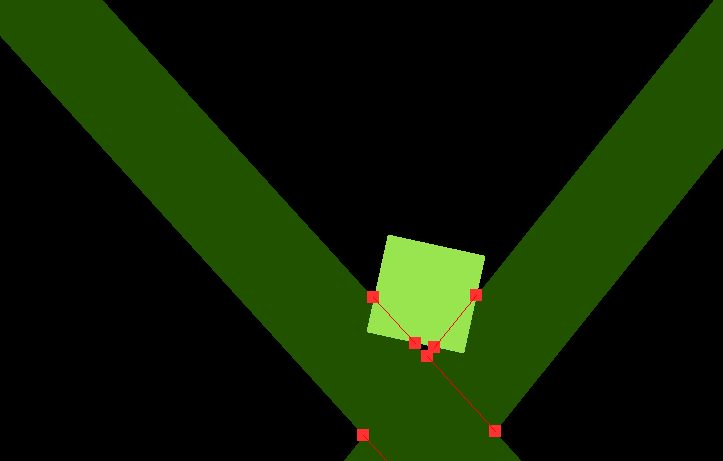

# Cliff Game

Deprecated

This will enetually be the source code to a game about building things along a cliff face. The project is entirely open source and done entirely in C++ with the SDL2 (Simple DirectMedia Layer 2) library.

## Progress on the Game
Right now, I am working on a physics system. You can see a visualization of my collision detection system. Soon I will put a video or gif here in its place!

